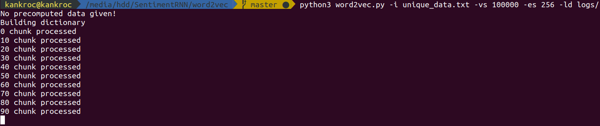
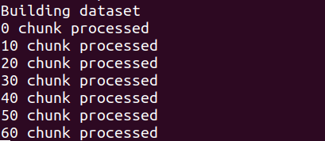
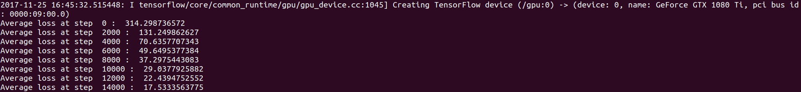

# SentimentRNN
A recurrent neural network that uses word embeddings to do sentiment analysis in both French and English. It uses an heavily modified version of the word2vec implementation shown on TensorFlow's website.

## Project condition

Testing + training is working. It does fit but some examples in my dataset stay stuck at 0 when their ground value is 1 and vice-versa.

## Creating word embeddings (word2vec.py folder)

From a terminal, enter `python3 word2vec.py -i [YOUR_CORPUS] -vs 100000 -es 256 -ld logs/`

You should first see something like this which is the dictionary being built:

That can go on for a while depending on the size of your corpus.

Then it will parse the whole corpus again to create the training sample files.

You should see .npy files appear in the folder with UUID as name (Obviously don't delete them)

Finally it will start the actual training. You can monitor the training using TensorBoard (if you specified a log directory).

Aaaaaaand you're done! Your embedding was saved as `data.npy` or whatever name you gave it!

Want to train again? Use `-pd` instead of `-i` to skip the first two steps!

## Training

From a terminal, do `python3 run.py --train -em embedding.npy -wl wordlist.txt`. The code will train a new neural network using the specified embedding.

## Testing

From a terminal, do `python3 run.py --test -m model/sentiment_rnn.pb --text test.txt`. The text example will be evaluated line-by-line to simply add \\n wherever you want to split it.
